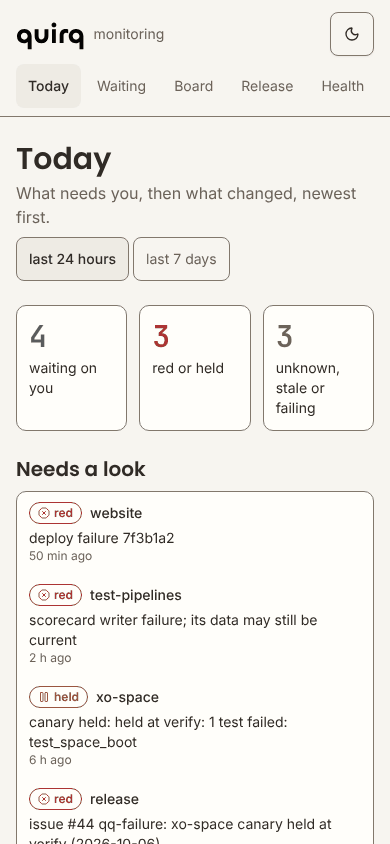

# monitoring

The quirq-ai monitoring dashboard: one page that says **what changed across the org and what state
everything is in**, on a phone or a desktop. suraj's Vercel project serves it at
[monitoring.quirq.dev](https://monitoring.quirq.dev/).

It is read-only. It reads the state the other repos already publish, shows it with the word
(`green`, `red`, `held`, `pending`, `unknown`, `stale`) before the color, and links every value to
the file or GitHub page it came from. It never merges, approves, comments or moves a ref.



(Fixture data from the test server, not the live org.)

Every page at phone and desktop width, light and dark, is in the `screenshots` artifact of each
CI run.

## The pages

| Page | The question it answers |
|---|---|
| **Today** (`/`) | Three counts on top (waiting on you; red or held; unknown, stale or failing), then what needs a look (a closed tree, a held or failed canary, a failed deploy, a new failure, a writer whose last run failed), then what changed in the last 24 hours (or 7 days): merged PRs, lkgr and channel moves, canary results, tree opened or closed, deploys, new failures. An alarm a newer event has cleared stays in the timeline, marked "since cleared". |
| **Waiting on you** (`/waiting`) | PRs where you are a requested reviewer or assignee, PRs you approved on an older head, held canaries, open `qq-failure` issues. |
| **Board** (`/board`) | One row per repo, grouped, the ones that need a look first: CI on main, open PRs, last merge; for products also tree, lkgr, canary and deploy. On a phone a green repo is one line that opens on tap. |
| **Release** (`/release`) | Per product: lkgr and each channel, the last 14 canary days as a strip, the hold if one is on, and the latest canary report. |
| **Health** (`/health`) | Whether each of the 9 scheduled writers ran on time, the scorecard, the gardener ledger, and every source this render read with its state. |
| **Repo** (`/repos/<name>`) | One repo's Board row (CI, last merge; for a product also tree, lkgr, canary and deploy), its open PRs, the checks on its head, and for a product its tree builders, its canary strip and its perf metrics. |
| **Snapshot** (`/api/snapshot`) | The same state as JSON (`qq-monitoring-snapshot/1`), for agents. `?since=7d` widens the window. |

Every tile shows the state first, then the detail, then where it came from and how old the data
says it is. A source that cannot be read shows `unknown` with the reason; a writer that has not run
inside its window shows `stale`, and so does every tile built from the files that writer keeps (the
tree, lkgr and canary tiles are only as current as the gardener and release jobs). A known fact
with no health in it ("nothing merged in 7 days") is plain text with no badge. When the GitHub API
as a whole is out (no token, rate limit, rejected token), one banner says so and the API tiles
read `unknown`. A count whose sources were not all read is a floor ("3+") or "?", never a green
zero. Nothing missing is ever shown as green.

**How old is what you see?** Today says "data as of" the oldest read behind that page's own
sources (the hourly org repo list does not count), or "No data could be read" when none answered.
Each source is cached for 2 to 60 minutes (the windows are in [AGENTS.md](AGENTS.md)); after a
quiet night the first view is served from that cache while it refreshes, so a Board or Release
tile read more than twice its window ago is marked `stale` rather than shown as current, and the
counts and the Today and Waiting lists say "stale: read 50 min ago" when a read behind them is
that old. Raw files add up to 5 minutes on top of that, and the PR search index a minute or two.

## Run it

Node 20.9 or later (CI runs 24) and pnpm 11.28.2 (`corepack enable` installs the pinned one).

```sh
pnpm install --frozen-lockfile
pnpm dev                      # http://localhost:3000, state-branch tiles work with no token
```

Add a token to make the GitHub API tiles (PRs, checks, deploys, writer runs, issues) work:

```sh
cp .env.example .env.local    # then put a read-only token in GITHUB_TOKEN
```

The token is a classic personal access token with **no scopes** (see Deploy for the exact
settings and why not a fine-grained one). Without one those tiles read `unknown` under a "GitHub
token not set" banner, and everything read from the state branches still works.
`MONITORING_ORG` (default `quirq-ai`) is the org it reads; `MONITORING_OWNER` (default
`sharmasuraj0123`) is whose "waiting on you" it is.

Check a change before pushing (CI runs the same):

```sh
pnpm lint && pnpm typecheck && pnpm test && pnpm build && pnpm e2e
pnpm live                     # every source once against the real branches, one line each
```

`pnpm test` and `pnpm e2e` never touch the network: they read captured and synthetic files through
a small fixture server (`tests/fixtures/`), so a Playwright run at 390 and 1280 px, light and dark,
is the same every time. The screenshots land in `test-results/screenshots/`, and CI uploads them.

## Where the data comes from

Only public data, from the repos that own it. Nothing is restated here.

- **State branches**: `release-state` in release (channels, lkgr and channel pointers, canary runs,
  holds, daily reports), `tree-status` in gardener, `results` in test-pipelines (scorecard,
  failure records), `perf-data` in perf. Read from raw.githubusercontent.com, which can be up to 5
  minutes behind. The daily canary report is Markdown, rendered as text and tables, never as HTML.
- **Config on main**: infra-config `config/repos.toml` (the products) and `config/channels.toml`
  (channel order and cadence), gate `settings/github.toml` (every repo behind the gate). This repo's
  `config/repos.json` adds only the repos neither names. Any public repo none of them knows shows
  under "Not in any registry".
- **The GitHub API**, with the token: PRs and reviews (one org-wide search, not a call per repo),
  check runs, deployments, the writers' workflow runs, `qq-failure` and `canary-report` issues, the
  org repo list.

The gardener `ledger` branch does not exist yet, so its tile reads `unknown: ledger not started`
until the gardener App lands. The one failure record on `results` today is a planted demo; it is
shown with a label and never counted.

Every path, schema, cache window and freshness rule is in [AGENTS.md](AGENTS.md), which is the
guide for the agents that build this. A PR that changes a source updates both files.

## Repos it covers

| Group | Repos | Also shows |
|---|---|---|
| Products | `xo-space`, `innernet`, `website` (from infra-config) | tree status, lkgr, canary, production deploy, perf |
| qq infra | every non-product repo in gate `settings/github.toml`: `infra-config`, `gate`, `test-pipelines`, `gardener`, `release`, `perf`, `rollers`, `toolchains`, `depot`, `sync`, `recipes`, `remote-build`, `installer` | whether their scheduled writers ran on time (Health) |
| Apps in progress | `euler`, `galileo`, `instants`, `quitter` | |
| Knowledge | `research`, `wiki`, `docs`, `marketing`, `.github` | |
| Other | `monitoring`, `xo-cowork-api`, `environment`, `quirq_ai`, `quirqy` | |

## Deploy

Vercel's GitHub app builds `main` into the production deployment and every PR into a preview (both
show up in the repo's deployments and on the PR). The project needs one environment variable:

1. Create a classic personal access token at https://github.com/settings/tokens/new: note
   `monitoring.quirq.dev read-only`, expiration 90 days, **no scopes ticked**. Every call the
   dashboard makes is a public read; the token only buys the 5,000-an-hour limit. A classic token
   rather than a fine-grained one because GitHub documents the Checks API as a gap of fine-grained
   tokens, and the Board reads `commits/<branch>/check-runs`. (Observed, cause not established: on
   2026-10-07 a fine-grained token limited to "Public repositories" was refused with 403 on the
   writers' Actions runs endpoints while the rest answered. Health now shows GitHub's own message
   next to such a 403; read it before drawing a conclusion.)
2. In Vercel, Settings > Environment Variables, add it as `GITHUB_TOKEN`, marked **Sensitive**, for
   **Production and Preview**.
3. **Redeploy** (a variable change does not rebuild by itself), then open Health: the GitHub API
   card should read "answering, with a token", and nothing on the page should read "GitHub API
   refused". The API card alone is not the check: it turns red only when every GitHub read
   fails, so it stays green while the writers' runs or the check runs are refused.

Rotate the token before it expires: an expired one shows a "GitHub token rejected" banner and
breaks nothing else. `MONITORING_OWNER` and `MONITORING_ORG` can be set the same way.

## What is not built

- Search, history charts, gate drift, push alerts, PostHog signals, a GitHub App in place of the
  token (v1, not started).
- Anything that writes: filing alert issues, approving, landing or releasing a hold from the
  dashboard (v2, waits for its own decision).
- The dev and stable channels show "nothing promoted yet" until release promotes to them.
- A secondary rate limit (a 403 with a `retry-after` header) is shown with GitHub's own words but
  not backed off from, and the API card does not turn amber when only some reads are refused.

## How it is built

Next.js 16 (App Router, server components), TypeScript strict, Tailwind 4 and shadcn/ui (Card,
Badge, Alert, Table, Collapsible, Skeleton, Button), zod for every file read, react-markdown for the
report, Vitest and Playwright. The quirq brand: wordmark from innernet, colors from
xo-space's `quirq` (dark) and `linen` (light) themes, Poppins, Inter and JetBrains Mono. Phone
first; text contrast at least 4.5:1 and markers at least 3:1 in both themes, checked by a test.
No popup ever scrolls. Titles and reports written by others are shown as text, never as HTML.

## License

Apache-2.0.
